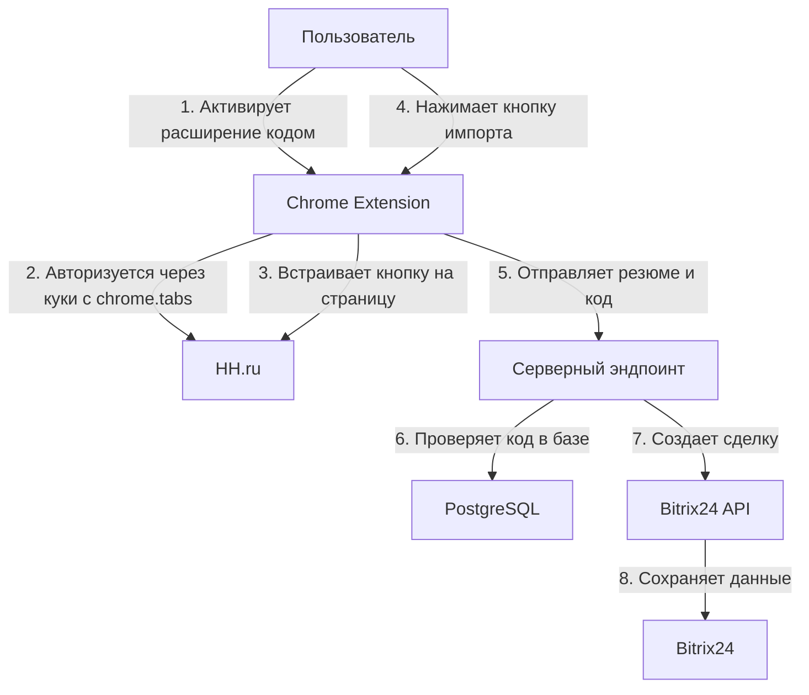

```mermaid
graph TD;
    User[Пользователь] -->|1. Активирует расширение кодом| Extension[Chrome Extension];
    Extension -->|2. Авторизуется через куки с chrome.tabs| HHru[HH.ru];
    Extension -->|3. Встраивает кнопку на страницу| HHru;
    User -->|4. Нажимает кнопку импорта| Extension;
    Extension -->|5. Отправляет резюме и код| Server[Серверный эндпоинт];
    Server -->|6. Проверяет код в базе| PostgreSQL[PostgreSQL];
    Server -->|7. Создает сделку| BitrixAPI[Bitrix24 API];
    BitrixAPI -->|8. Сохраняет данные| Bitrix24[Bitrix24];
```
