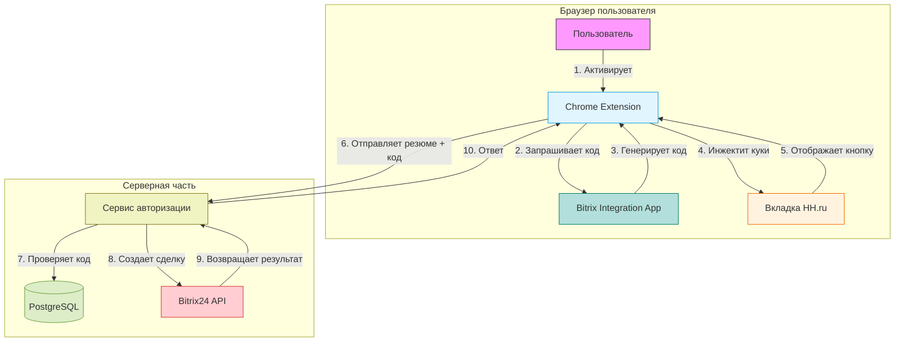

```mermaid
graph TD;
    subgraph Browser[Браузер пользователя]
        A[Пользователь] -->|1. Активирует| B[Chrome Extension]
        B -->|2. Запрашивает код| C[Bitrix Integration App]
        C -->|3. Генерирует код| B
        B -->|4. Инжектит куки| D[Вкладка HH.ru]
        D -->|5. Отображает кнопку| B
    end

    subgraph Backend[Серверная часть]
        B -->|6. Отправляет резюме + код| E[Сервис авторизации]
        E -->|7. Проверяет код| F[(PostgreSQL)]
        E -->|8. Создает сделку| G[Bitrix24 API]
        G -->|9. Возвращает результат| E
        E -->|10. Ответ| B
    end

    style A fill:#f9f,stroke:#333
    style B fill:#e1f5fe,stroke:#039be5
    style C fill:#b2dfdb,stroke:#00796b
    style D fill:#fff3e0,stroke:#ef6c00
    style E fill:#f0f4c3,stroke:#827717
    style F fill:#dcedc8,stroke:#689f38
    style G fill:#ffcdd2,stroke:#d32f2f
```
